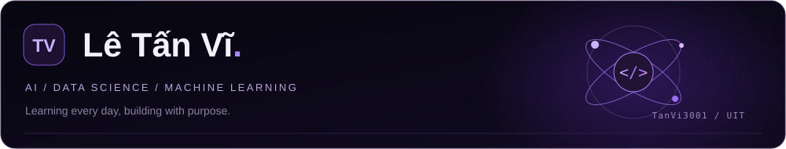
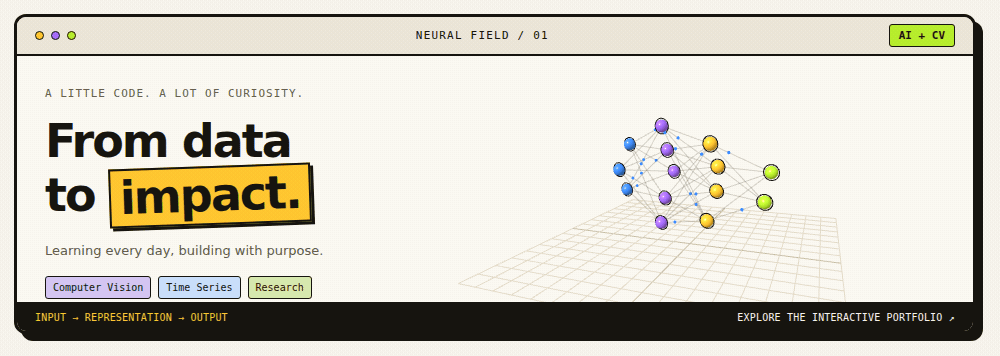
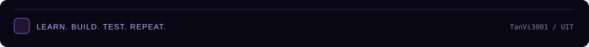

  

  

  
  
  
  

  

  
   
  Computer Vision · Time Series · Research · Open the portfolio to explore the interactive 3D scene

---

## 🧠 About Me

- 👋 Hi, I'm **Lê Tấn Vĩ (TanVi3001)**
- 🎓 **UIT Student** passionate about **AI, Data Science, and real-world ML**
- 🔬 Main interests: **Machine Learning, Computer Vision, Data Analytics**
- 🧩 Strengths: **Problem Solving, Logical Thinking, Team Collaboration**
- 🚀 Mission: Build useful projects and grow into a strong AI Engineer

 

---

## ⚡ Current Focus

- 📘 Strengthening **ML fundamentals** (end-to-end pipeline)
- 🧪 Practicing **feature engineering** and **model evaluation**
- 🛠️ Building portfolio projects with clean structure
- 🌱 Learning **MLOps basics** and model deployment

---

## 🏆 Trophies

  

---

## 📊 Performance Dashboard

  

  
  

  <a href="https://github.com/TanVi3001?tab=overview">View contribution activity on GitHub</a>

---

## 🛠️ Tech Stack

### Tools, languages, and technologies I enjoy

<table>
  <tr>
    <td align="center" width="96"> Python</td>
    <td align="center" width="96"> Java</td>
    <td align="center" width="96"> C++</td>
    <td align="center" width="96"> MySQL</td>
    <td align="center" width="96"> Oracle</td>
    <td align="center" width="96"> GitHub</td>
  </tr>
  <tr>
    <td align="center" width="96"> R</td>
    <td align="center" width="96"> TensorFlow</td>
    <td align="center" width="96"> OpenCV</td>
    <td align="center" width="96"> Pandas</td>
    <td align="center" width="96"> NumPy</td>
    <td align="center" width="96"> VS Code</td>
  </tr>
</table>

---

## 🐍 Contribution Snake

  

---

## 🌐 Connect

  
  

  

---

## 💬 Random Dev Quote

  

---

## 💡 Motto

  <i>"Code in silence. Let your results make the noise."</i>

  

